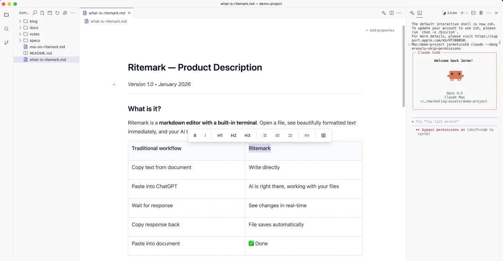

# Ritemark

**A markdown editor with a built-in terminal.** Open a file, see beautifully formatted text, and your AI is right there ready to help.

---

## What is Ritemark?

Ritemark combines a WYSIWYG markdown editor with an integrated terminal, so you can write documents while your AI assistant (Claude Code, Codex, Gemini CLI, etc.) reads and edits your files directly.

**No more copy-paste between ChatGPT and your documents.**

| Traditional workflow | Ritemark |
|---------------------|----------|
| Copy text from document | Write directly |
| Paste into ChatGPT | AI is right there, working with your files |
| Wait for response | See changes in real-time |
| Copy response back | File saves automatically |
| Paste into document | Done |

---

## Download

**[Download for macOS (Apple Silicon)](https://github.com/jarmo-productory/ritemark-public/releases/latest/download/RiteMark-1.94.0-darwin-arm64.dmg)**

- **Platform:** macOS (Apple Silicon)
- **Price:** Free
- **License:** MIT (Open Source)

---

## Features

### See beautiful text, not code
Markdown renders as formatted text. Tables, images, headings — all beautiful. No `# ## ** []` syntax in your face.

### AI reads and edits directly
Terminal built into the app. Your AI sees the file, makes changes, saves. You just review and approve.

### Everything stays on your computer
No cloud. No account. Your files are plain `.md` files on your hard drive. Works offline.

### Free and simple
Download, open a file, start writing. No signup, no subscription, no hidden fees.

---

## How it works

1. **Open your document** — Plain markdown files. No import, no conversion.
2. **Press `Cmd+\``** — Terminal appears. Your AI already has context.
3. **AI reads, edits, saves** — Changes appear live. You review and approve.

---

## Who is it for?

- **Knowledge workers** — Who write documents, specs, blog posts
- **AI terminal users** — Claude Code, Codex, Gemini CLI — same workflow for text
- **Markdown enthusiasts** — Who want a native desktop app with WYSIWYG view
- **Privacy-conscious writers** — Who don't want cloud-only tools

---

## Built by

**[Jarmo Tuisk](https://productory.ee/en/team/jarmo-tuisk)** @ **[Productory](https://productory.ee)** — Estonia's leading AI trainer.

I used Claude Code every day for coding. I wanted the same experience for writing. That's how Ritemark was born.

- 9000+ people trained in AI
- 200+ companies

---

## Support

- **Bug reports:** [Open an issue](https://github.com/jarmo-productory/ritemark-public/issues/new?template=bug_report.md)
- **Feature requests:** [Open an issue](https://github.com/jarmo-productory/ritemark-public/issues/new?template=feature_request.md)
- **Website:** [ritemark.productory.ee](https://productory.ee/ritemark)

---

## License

MIT License — see [LICENSE](LICENSE) for details.

---

*Made with care in Estonia.*
