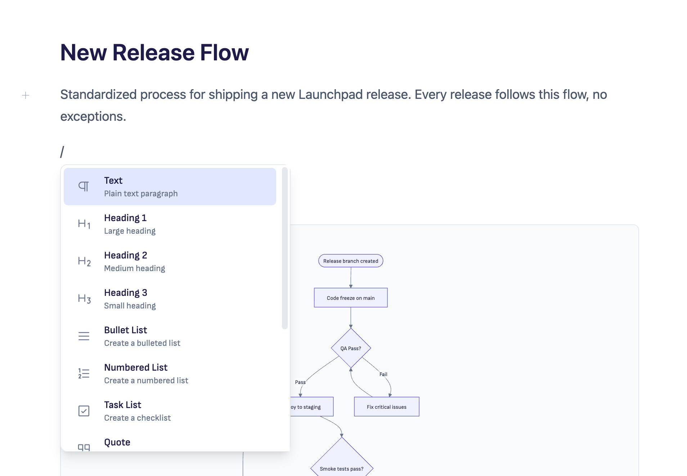
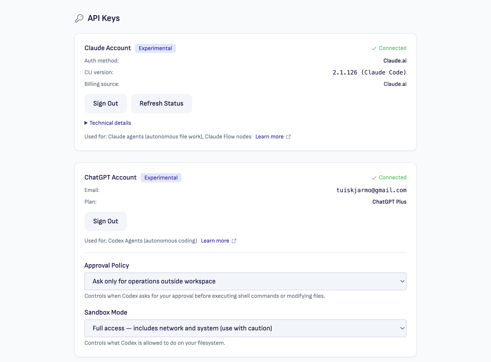
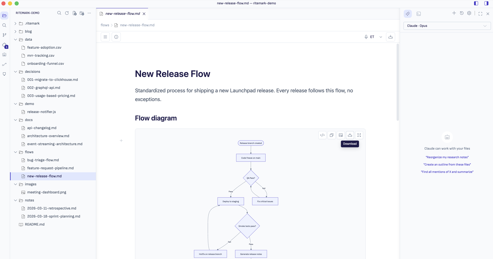

# Ritemark

**A writing app with AI agents built in.**

Ritemark is a markdown editor where Claude, Codex, and Gemini work alongside you. Chat with agents visually. They read your files, edit them, create new ones. You stay in control.

`Visual agent chat` · `No technical skills needed` · `Free & open source`

* * *

## Download

**Latest: v1.6.1** — May 2026

| Platform | Download |
| --- | --- |
| macOS Apple Silicon (M1/M2/M3) | [Ritemark-arm64.dmg](https://github.com/jarmo-productory/ritemark-public/releases/latest/download/Ritemark-arm64.dmg) |
| macOS Intel | [Ritemark-x64.dmg](https://github.com/jarmo-productory/ritemark-public/releases/latest/download/Ritemark-x64.dmg) |
| Windows | Coming soon — will be added as a follow-up asset on the [v1.6.1 release](https://github.com/jarmo-productory/ritemark-public/releases/latest) |

All builds are signed and notarized. See [release notes](https://github.com/jarmo-productory/ritemark-public/releases/latest) for checksums and full changelog.

[Read more about Ritemark](https://www.ritemark.app)

* * *

## The shift

AI agents can work on your documents now. Not just code.

If you're a product manager, consultant, founder, or technical writer, AI agents can transform your workflow. They draft from real project context. Rewrite across multiple files. Translate entire folders. The same agents that developers use for code can now help you write, restructure, and translate documents.

Until now, the tools that run these agents required a terminal. Ritemark changes that. You chat with Claude, Codex, or Gemini visually. No command line, no setup complexity. The agent sees your project files and works with them directly. You write in a visual editor, give directions in plain language, and review every change before it's saved.

* * *

## How Ritemark works

**One window. Three panes. Zero context switching.** You write in the center. The agent assists on the right. Your files stay on your drive.

* * *

## Features

### Editor

Visual markdown editing with live preview. Write formatted text, not syntax. Standard `.md` files that any tool reads. Slash commands for headings, lists, tables, code blocks, images, and diagrams. Native Mermaid with a toolbar for copy, download, and full-screen expand. Voice dictation in 50+ languages — fully on-device.

### AI agents

Three agents in one sidebar. Sign in via browser — no terminal, no CLI install. Switch providers with a dropdown — no lock-in. Plan mode, interactive questions, and full file context built in. Full CLI terminal also built in if you want it.

### Local-first

Files on your hard drive. No cloud, no account, no sync. Full offline support — AI features need their own API connection, but the editor works without it. Your data stays yours.

### Data files

Native support for CSV. View and edit structured data alongside your prose.

### Flows

Chain AI operations into repeatable workflows. Build templates for common writing tasks and run them with one click.

* * *

## Who is it for?

You don't need to code to use AI agents. Product managers, founders, technical writers, and consultants are already using Ritemark to work with AI agents on their real files.

-   **Product Managers** — PRDs, specs, roadmaps. Agents pull context from your project files and help you iterate faster.
    
-   **Founders & Executives** — Strategy docs, investor updates, competitive analysis. The agent reads everything in the folder and drafts from real context.
    
-   **Technical Writers** — Documentation, API guides, knowledge bases. Agents restructure, translate, and expand drafts without losing formatting.
    
-   **Consultants** — Client reports, proposals, deliverables. Compile multiple source files into polished outputs.
    

* * *

## Open source & local-first

**Your files. Your rules.** Ritemark is open source and local-first. Your documents are plain markdown files on your hard drive. No cloud sync, no vendor lock-in, no account required. The code is on GitHub for anyone to inspect.

-   **Plain markdown files** — Standard `.md` format. Open them in any editor, any time.
    
-   **Works offline** — No internet needed to write. AI features need their own API connection.
    
-   **No account, no tracking** — Download and start writing. We don't know who you are and we like it that way.
    
-   **Source on GitHub** — Read the code, report issues, contribute. Transparency is the default.
    

* * *

## Built by

[**Jarmo Tuisk**](https://www.linkedin.com/in/jarmotuisk/) and [**Productory**](https://productory.eu) — an AI training and consulting company based in Estonia.

We've trained 9000+ professionals and worked with 200+ companies on practical AI adoption. Ritemark is the editor we wanted for ourselves: AI-native, local-first, and genuinely pleasant to write in.

Learn more at [ritemark.app](https://ritemark.app).

* * *

## Support

-   **Bug reports:** [Open an issue](https://github.com/jarmo-productory/ritemark-public/issues/new?template=bug_report.md)
    
-   **Feature requests:** [Open an issue](https://github.com/jarmo-productory/ritemark-public/issues/new?template=feature_request.md)
    
-   **Releases:** [GitHub Releases](https://github.com/jarmo-productory/ritemark-public/releases)
    

* * *

## License

MIT. Use it, fork it, ship it.

* * *

Made in Estonia.